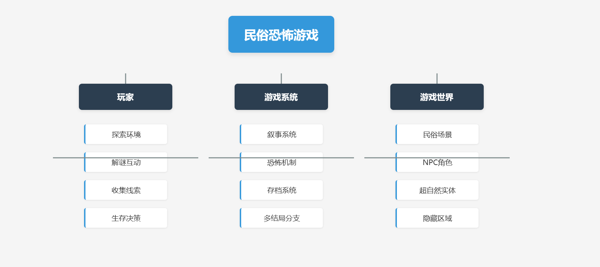
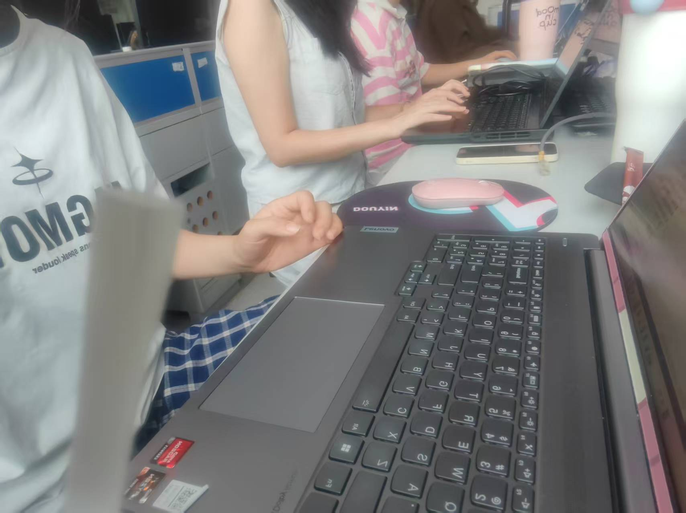

# 软件工程定项第一次会议记录

 * **参会者**：陈雁翎，朱妍，戴唐颖，王慧
 * **时间**：2025年9月23号周二 南一楼804

## 项目选择
> 叙事驱动的互动解谜冒险游戏
### 1. 主要技术栈
**分成前端和后端网页开发**

**前端**：Godot引擎 + GDScript + 游戏资源(场景/音效/UI)

**后端**：Python/Java + MySQL/SQLite + 云存储

### 2. 团队分工

**前端开发**：戴唐颖，王慧

**后端开发**：朱妍，陈雁翎

**接口对接**：戴唐颖，王慧，陈雁翎，朱妍

   

## 项目分析（头脑风暴）

### 1. 现有选课（题）系统的不足
>* 玩家需求：现在互动解密游戏在年轻人中十分火爆，比如“盛世天下”，但是此题材游戏不多，玩家需求量大。
>* 剧情薄弱：很多恐怖游戏过于依赖 jump scare，而忽视故事深度。
>* 文化内涵不足：一些游戏对民俗的挖掘不够深入，流于表面。
>* 互动性差：解谜元素简单，玩家参与度不高。
>* 重复可玩性低：线性剧情，缺乏多结局，玩家通关后不再重复游戏

### 2. 改进方式

- [x] 长时间开启，截止时期前能选择。

- [x] 选课系统负载均衡，（时间匀开）（在经常开启的模式下保证服务器不过载）

- [x] 公开，个性化选课推荐定制。

- [x] 评价系统（每个课程给一个帖子参考慕课）

- [x] 拥有完善的退选机制。

- [x] 方便管理，管理界面优化（上传课程，课程交流区（反馈）），权限系统。

### 3. 题目来源

* ​教师积累​：近5年教师提供的课程设计题目
* ​优秀作品转化​：往届学生完成的优秀课设项目转化而来的新题目

### 4. 需求

* 用户注册与登录(生成角色，玩家自行分配固定属性点)
* 用户数据管理(记录用户属性值，支持存档读档，结局收集成就)
* 角色图鉴(记录见过的剧情角色，他们的姓名、身份、好感值等)
* 主线与剧情系统(剧情触发需要某种条件，否则走向支线剧情)
* 互动选项(与 NPC产生交互，触发选项，走向不同的剧情)
* 即时交互与操作反馈(某些选项进行 QTE 校准，难度与用户属性值有关)
* 音频与音效(烘托氛围的背景音乐)

## 思维导图

## 会议图片

