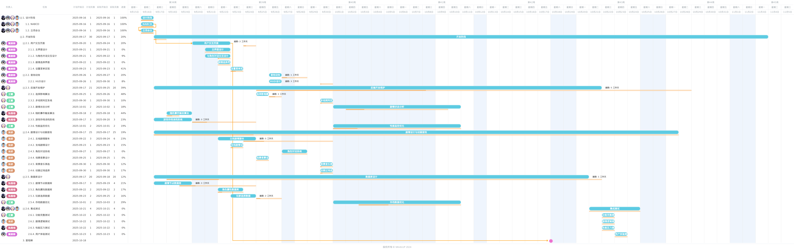

## 任务分解
任务安排:
### 前端设计与用户交互页面：（戴唐颖）
1. 主界面设计
2. 对话交互界面
3. 剧情选择界面
4. 游戏HUD设计
5. 设置菜单实现
6. 存档读档界面
7. 交互动效实现

### 后端开发维护：（王慧，陈雁翎）
1. 剧情状态管理
2. 选择影响算法
3. 多结局判定系统
4. 随机事件调度
5. 游戏存档系统
6. 性能监控优化

### 游戏剧情设计与动画音效 ：（朱妍）
1. 主线剧情脚本
2. 支线剧情设计
3. 角色对话系统
4. 谜题逻辑设计
5. 场景背景设计
6. 音效资源制作
7. 背景音乐筛选
8.  动画过场制作

### 数据库设计与后端开发：（陈雁翎，王慧）
1. 剧情节点数据库
2. 角色属性数据库
3. 玩家选择记录库
4. 游戏配置数据库
5. 存档数据优化

### 集成测试：（王慧，陈雁翎，戴唐颖，朱妍）
1. 功能完整性测试
2. 剧情逻辑测试
3. 多平台兼容测试
4. 性能压力测试
5. 用户体验测试

发布：（陈雁翎，戴唐颖，王慧，朱妍）

## 进度安排
在线链接：
https://gantt.mindsup.cn/share/dvwvOKVXT

